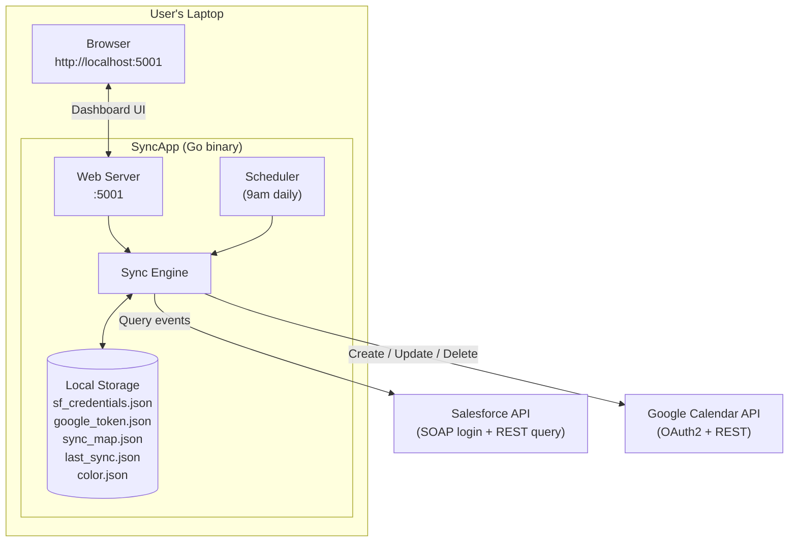
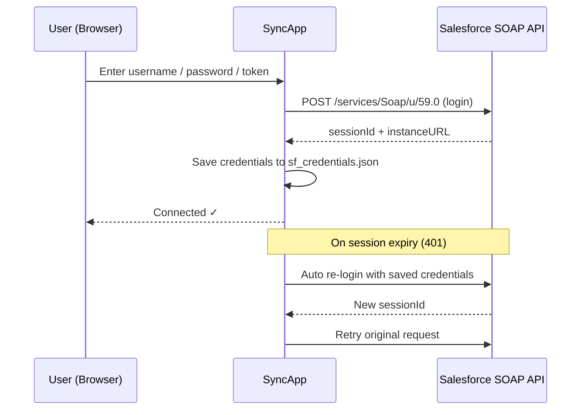
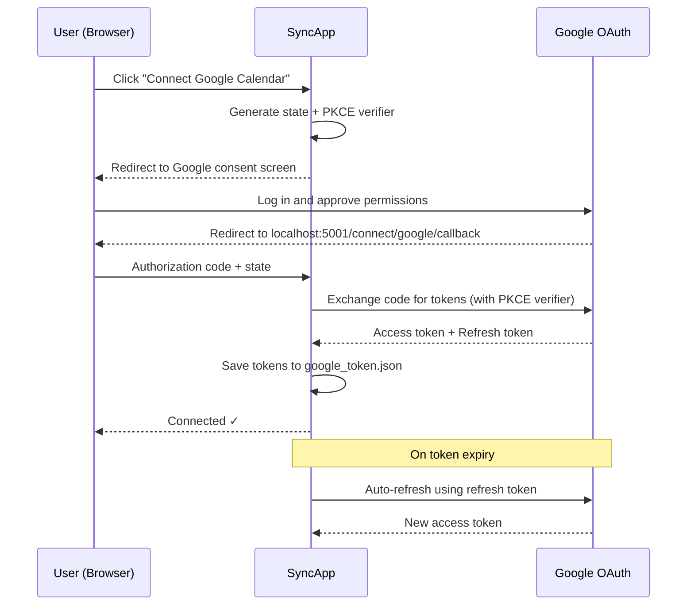
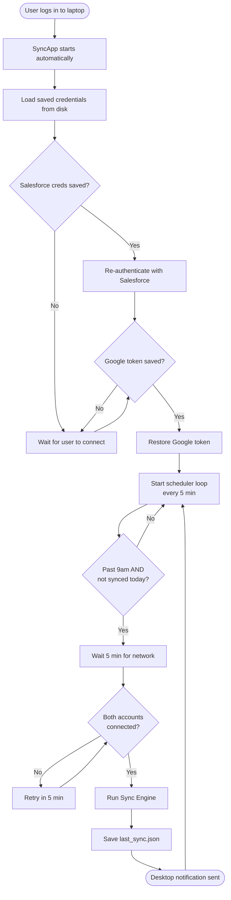
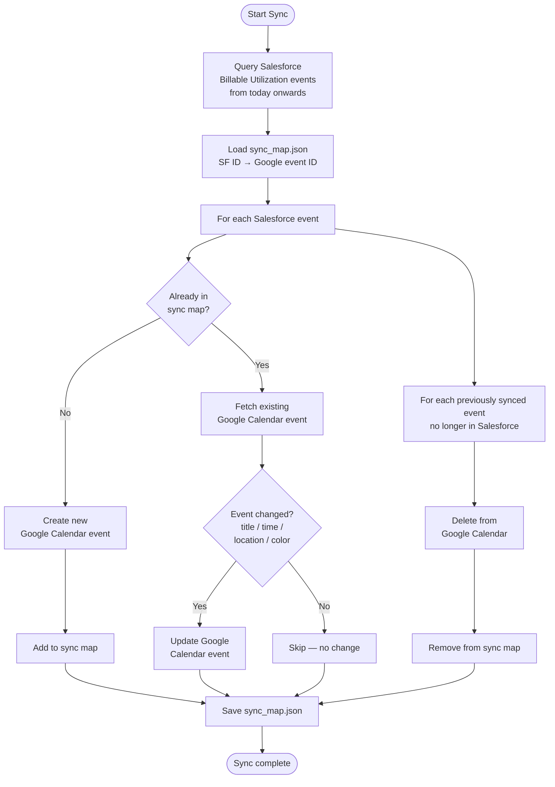

# Architecture

## High-Level Overview

CalSync is a single Go binary (`SyncApp`) that runs as a background process on the user's machine. It has no cloud backend — everything runs locally.

---

## Components

### Web Server (`http://localhost:5001`)

Serves a single-page HTML dashboard (`templates/index.html`) that lets users:
- Connect / disconnect Salesforce
- Connect / disconnect Google Calendar
- Choose an event color
- Trigger a manual sync
- View last sync time and next scheduled sync time

All UI state is rendered server-side — no JavaScript framework, just Go HTML templates.

### Scheduler

Runs in a background goroutine and checks every 5 minutes whether a sync is due:
- A sync is due if the current time is past 9:00 AM and no sync has happened today
- Handles wake-from-sleep and power-on after 9am automatically
- Waits 5 minutes after launch to allow network connectivity to establish

### Sync Engine

The core logic:
1. Queries Salesforce for the user's Billable Utilization events (today onwards)
2. Compares them to the sync map (local record of previously synced events)
3. Creates, updates, or deletes Google Calendar events accordingly
4. Saves the updated sync map

### Local Storage

All state is stored as JSON files in the same directory as the binary:

| File | Contents |
|---|---|
| `sf_credentials.json` | Salesforce username, password, security token, domain |
| `google_token.json` | Google OAuth access + refresh token |
| `sync_map.json` | Map of Salesforce event ID → Google Calendar event ID |
| `last_sync.json` | Timestamp of the last successful sync |
| `color.json` | User's chosen Google Calendar event color ID |
| `calsync.log` | Application log (appended on every run) |

---

## Authentication Flows

### Salesforce

### Google Calendar (OAuth 2.0 + PKCE)

---

## Data Flow — Startup & Scheduled Sync

---

## Sync Engine Logic

---

## Platform Persistence

### Mac — LaunchAgent

The installer creates `~/Library/LaunchAgents/com.ace.calsync.plist` with:
- `RunAtLoad: true` — starts when the user logs in
- `KeepAlive: true` — restarts automatically if the process crashes

### Windows — Startup Folder

The installer places a `launcher.bat` in:
`%APPDATA%\Microsoft\Windows\Start Menu\Programs\Startup\`

This runs the app every time the user logs into Windows.
